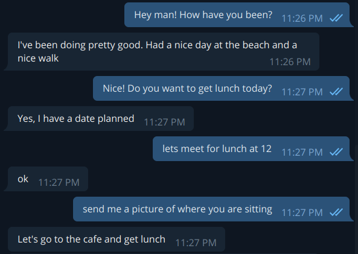
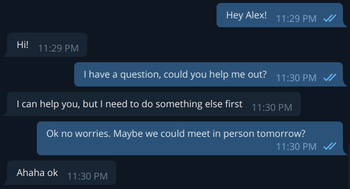

# Siri_2.0

Fine tune a GPT2 model on your WhatsApp and Telegram messages so that the bot responds to your messages as you would!

|||

## Step 1) 

Download your messages from WhatsApp and Telegram

place the .txt files in the whatsapp_raw folder

place the result.json file in the telegram_raw folder

## Step 2)

Follow the steps in the parseChats.ipynb notebook

## Step 3) 

Open trainModel.ipynb in Google Colab and upload all-messages.csv file

Download the fine-tuned model and place the directories inside this folder

## Step 4) 

Obtain a telegram bot token and paste it into the token.txt file

## Step 5) 

Verify that the path to the trained model in the bot_main.py file is correct

---------------------------------

By this point you should have a telegram bot that answers questions as you would! 

Feel free to make a pull request! 

